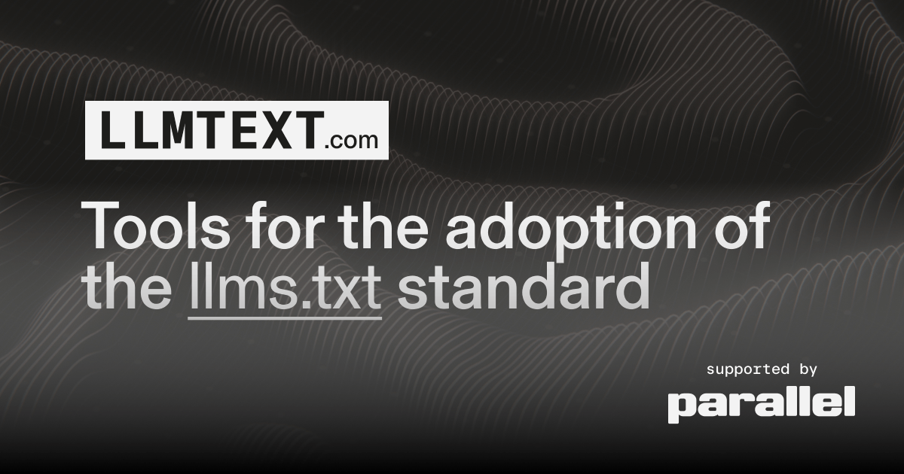

# LLMTEXT - Tools for the adoption of the `llms.txt` standard

## Get started

1. Visit **[llmtext.com](https://llmtext.com)** to install MCP servers from popular documentation sites, or paste any `llms.txt` URL to create your own.

2. Create your own `llms.txt` from your entire website (not just the docs) by using our [extract-from-sitemap](extract-from-sitemap) tool. See [this template](https://github.com/parallel-web/parallel-llmtext) to easily create your own.

### More Tools

- [llmtext.check](llmtext.check): Check llms.txt validity
- [llmstxt-generate](llmstxt-generate): Use this in combination with [getassetmanifest](getassetmanifest) if you want to deploy static assets already present in your fs as a `llms.txt`.
- [llmtext.mcp](llmtext.mcp): converts a llms.txt into a dedicated MCP server
- [llmtext.reader](llmtext.reader): converts HTML into simplified "browser-reader HTML", drastically improving token density
- [parse-llms-txt](parse-llms-txt) - parse llms.txt according to [the standard](https://llmstxt.org)

### Other

- [llmtext](llmtext): the website
- [llmtext.login](llmtext.login): X OAuth flow for the MCP

## Sponsors

<a href="https://parallel.ai">
<picture>
  <source media="(prefers-color-scheme: dark)" srcset="llmtext/og-dark.png">
  <source media="(prefers-color-scheme: light)" srcset="llmtext/og-light.png">
  
</picture>
</a>
