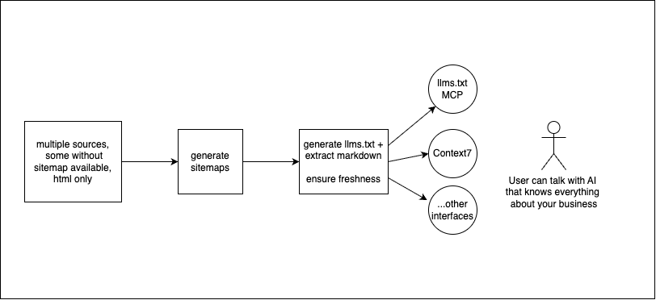
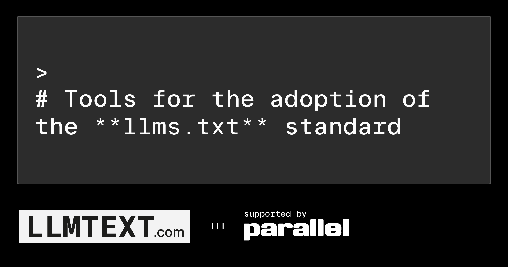

# LLMTEXT - Tools for the adoption of the `llms.txt` standard

[Read the announcement post](https://parallel.ai/blog/LLMTEXT-for-llmstxt)

## Get started

1. Visit **[llmtext.com](https://llmtext.com)** to install MCP servers from popular documentation sites, or paste any `llms.txt` URL to create your own.

2. Create your own `llms.txt` from your entire website (not just the docs) by using our [extract-from-sitemap](extract-from-sitemap) tool. See [this template](https://github.com/parallel-web/parallel-llmtext) to easily create your own.

### Libraries

- [getassetmanifest](getassetmanifest): deploy static assets already present in your fs as a `llms.txt`.
- [extract-from-sitemap](extract-from-sitemap): Generate llms.txt from a sitemap
- [llms-txt-fetch](llms-txt-fetch): fetch all contents of a `llms.txt`
- [llms-txt-generate](llms-txt-generate): Use this in combination with [getassetmanifest](getassetmanifest) if you want to deploy static assets already present in your fs as a `llms.txt`.
- [llms-txt-mcp](llms-txt-mcp): converts a llms.txt into a dedicated MCP server
- [llms-txt-parse](llms-txt-parse): parse llms.txt according to [the standard](https://llmstxt.org)
- [llms-txt-validate](llms-txt-validate): Check llms.txt validity
- [shared-crawler](shared-crawler): Crawls a website and stores results in DOs so anyone can access them cheaply. Available via https://crawl.llmtext.com. Is used

### Other

- [llmtext](llmtext): the website. Also exposes https://llmtext.com/%s where %s can be any url to get markdown for it. Depends on [shared-crawler](shared-crawler) for that.
- [llmtext.login](llmtext.login): X OAuth flow for the MCP
- [llmtext.reader](llmtext.reader): converts HTML into simplified "browser-reader HTML", drastically improving token density

### Other interesting repos

- [markdown-renderer](https://github.com/janwilmake/markdown-renderer): Chrome/Safari Extension that renders markdown responses
- [markdownbrowser](https://github.com/janwilmake/markdownbrowser)

## Sponsors

<a href="https://parallel.ai">
<picture>
  <source media="(prefers-color-scheme: dark)" srcset="llmtext/og-dark.jpg">
  <source media="(prefers-color-scheme: light)" srcset="llmtext/og-light.jpg">
  
</picture>
</a>

<!--

I had a repo to scrape the entire website of simonw

Notable private projects - https://github.com/janwilmake/xybrowse

https://github.com/janwilmake/markdownbrowser
https://github.com/janwilmake/openwebgate - THIS IS THE SHADOW SITE PRINCIPLE

https://github.com/janwilmake/llmtext.browser
https://github.com/janwilmake/llmtext.crawler
https://github.com/janwilmake/llmtext.expand
https://github.com/janwilmake/llmtext.callmeinstead

https://github.com/janwilmake/web-reader

shadowsites

https://github.com/janwilmake/arxivmd.org
https://github.com/janwilmake/googllm https://github.com/janwilmake/googllm-parallel https://github.com/janwilmake/googllm-raw
-->
